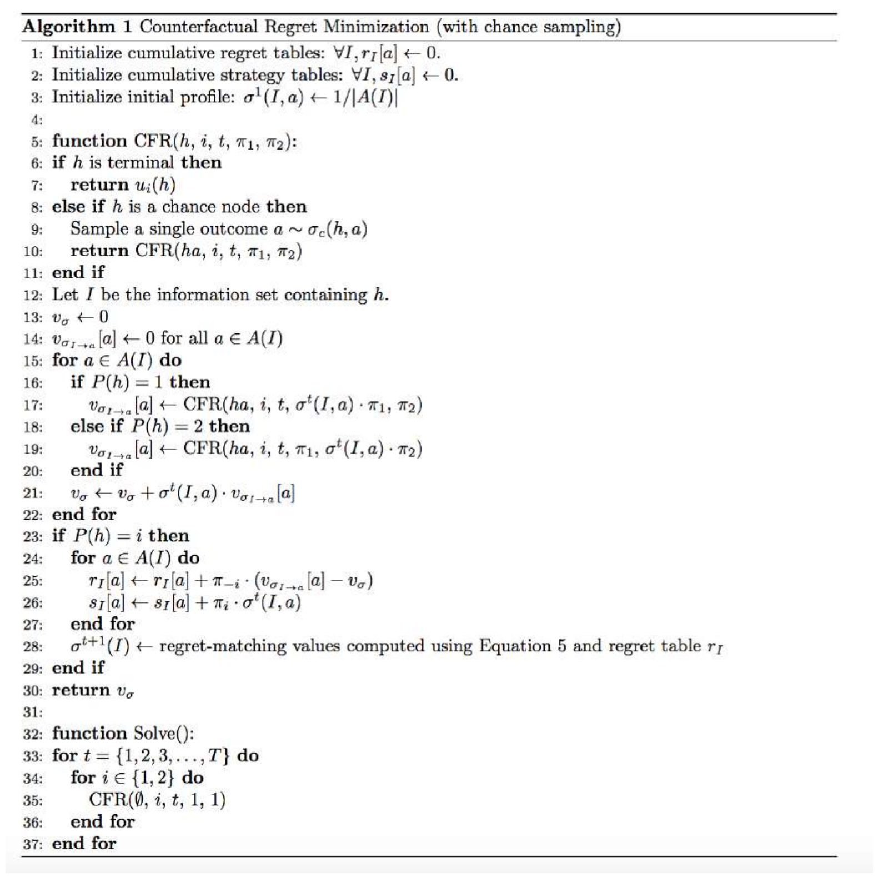
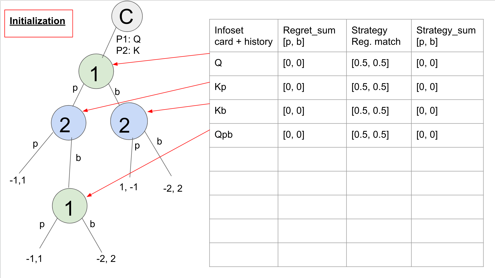
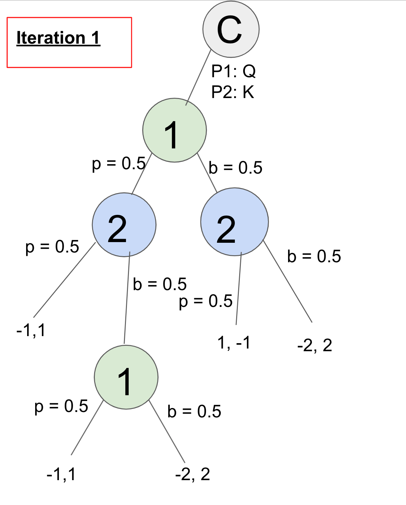
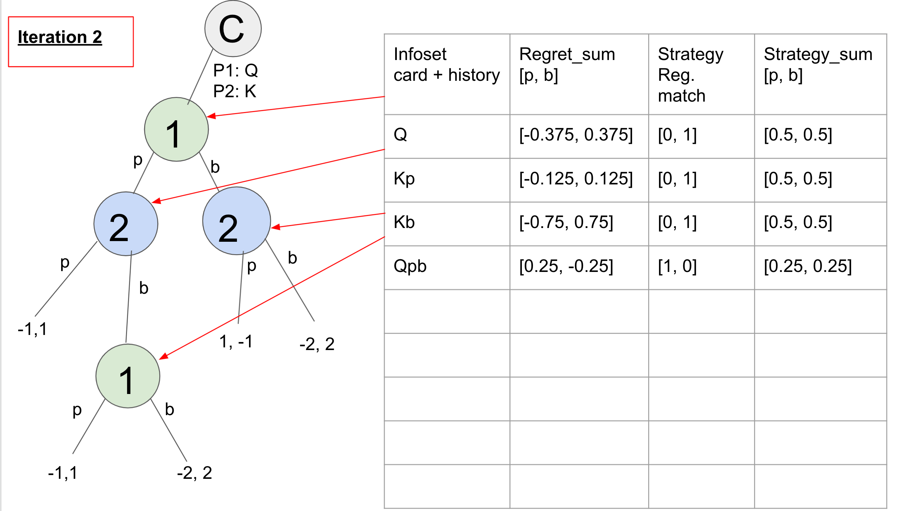
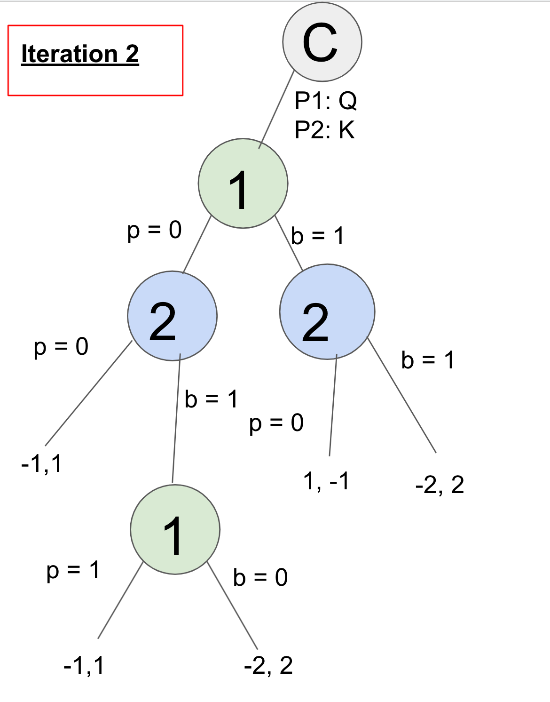
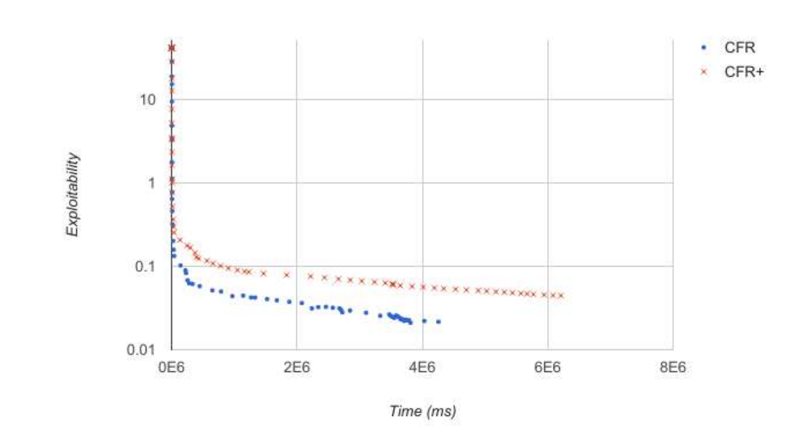

<!-- 
TODO: 
1) Review my thesis
2) Iteration automation/visualization, maybe with Winston (what about interpretabilitu)
3) Coding simple both with (a) basic input, (b) response to opponent, (c) CFR, (d) advanced CFR
4) Minimization explanation
5) https://pypi.org/project/PokerRL/, https://xscode.com/tansey/pycfr, https://github.com/tansey/pycfr, https://rlcard.org/index.html, https://github.com/datamllab/rlcard, https://towardsdatascience.com/rlcard-building-your-own-poker-ai-in-3-steps-398aa864a0db, https://github.com/paul-chelarescu/counterfactual-regret-minimization, https://github.com/DabeLong/Two-Card-Poker-CFR-AI/blob/master/cfr.py, https://github.com/int8?tab=repositories 
-->

# CFR - The CFR Algorithm 
The Counterfactual Regret Minimization (CFR) algorithm was first published in a 2007 paper from the University of Alberta by Martin Zinkevich et al. called "[Regret Minimization in Games with Incomplete Information](https://poker.cs.ualberta.ca/publications/NIPS07-cfr.pdf)". 

## TLDR Explanation
CFR is a self-play algorithm that learns by playing against itself repeatedly. It starts play with a uniform random strategy (each action at each decision point is equally likely).  

At each information set in the game tree, the algorithm keeps a counter of regret values for each possible action. The regret means how much better the agent would have done if it had always played that action rather than the actual strategy that could be a mixture of actions. Positive regret means we should have taken that action more and negative regret means we would have done better by not taking that action. 

The values computed with the regret are called counterfactual values, which are the value of playing an action at a certain game state weighted by the probability (counterfactual assumption) of the other agent playing to that game state. 

For example, if the agent was playing a game in which it had 5 action options at a certain game state and Action 1 had a value of 3 while the game state average over all 5 actions was 1, then the regret would be 3-1 = 2. This means that Action 1 was better than average and we should favor taking that action more. 

The CFR algorithm updates the strategy after each iteration to play in proportion to the regrets, meaning that if an action did well in the past, the agent would be more likely to play it in the future. 

The final Nash equilibrium strategy is the average strategy over each iteration. This strategy can do no worse than tie in expectation and is considered optimal since it's unbeatable in expectation. This is what we mean when we say "solve" a poker game. 

## Detailed Intuitive Explanation
Michael Johanson, one of the authors on the original paper, gave his intuitive explanation of CFR in a [post on Quora](https://www.quora.com/What-is-an-intuitive-explanation-of-counterfactual-regret-minimization). 

## The Algorithm
Due to the constraints of solving imperfect information games with MCTS and the memory limits and zero-sum/perfect recall requirements of solving games with linear programs, CFR was developed as a novel solution. CFR also benefits from being computationally cheap, doesn’t require parameter tuning, and pruning can be used. It is an iterative Nash equilibrium approximation method that works through the process of repeated self-play between two regret minimizing algorithms.

CFR is an extension of regret minimization into sequential games, where players play a sequence of actions to reach a terminal game state. Instead of storing and minimizing regret for the exponential number of strategies, CFR stores and minimizes a regret for each information set and subsequent action, which can be used to form an upper bound on the regret for any deterministic strategy. This means that we must also consider the probabilities of reaching each information set given the players’ strategies, as well as passing forward game state information and probabilities of
player actions, and passing backward utility information through the game information states. The algorithm is required only to store a strategy and regret value for each node and each action at each node, such that the space requirement is on the order O(|I|), where |I| is the number of information sets in the game.

CFR is an offline self-play algorithm, as it learns to play by repeatedly playing against itself. It begins with a strategy that is completely uniformly random and adjusts the strategy each iteration using regret matching such that the strategy at each node is proportional to the regrets for each action. The regrets are, as explained previously, measures of how the current strategy would have performed compared to a fixed strategy of always taking one particular action. Positive regret means that we would have done better by taking that action more often and negative regret means that we would have done better by not taking that action at all. The average strategy is then shown to approach a Nash equilibrium in the long run.

In the vanilla CFR algorithm, each iteration involves passing through every node in the extensive form of the game. Each pass evaluates strategies for both players by using regret matching, based on the prior cumulative regrets at each player’s information sets. Before looking at the CFR equations, we will provide some definitions.

We will refresh some definitions that were given in previous sections here when they
are relevant to the forthcoming equations.

Let A denote the set of all game actions. We refer to a strategy profile that excludes
player i’s strategy as sigma_(-i). A history h is a sequence of actions, including chance
outcomes, starting from the root of the game. Let pi^(sigma)(h) be the reach probability of
game history h with strategy profile sigma and pi^sigma(h,z) be the reach probability that
begins at h and ends at z. 

Let Z denote the set of all terminal game histories and then we have h ⊏ z for z ∈ Z is
a nonterminal game history. Let u_i(z) denote the utility to player i of terminal history
z.

We can now define the counterfactual value at nonterminal history h as follows:
v_i(sigma, h) = sum (z in Z),h ⊏ z of pi^sigma_(-i)*pi^sigma(h,z)*u_i(z)

This is the expected utility to player i of reaching nonterminal history h and taking
action a under the counterfactual assumption that player i takes actions to do so, but
otherwise player i and all other players follow the strategy profile sigma.

The counterfactual value takes a player’s strategy and history and returns a value that
is the product of the reach probability of the opponent to arrive to that history and the
expected value of the player for all possible terminal histories from that point. This is
counterfactual because we ignore the probabilities that factually came into player i’s
play to reach position h, which means that he is not biasing his future strategy with his
current strategy. This weights the regrets by how often nature (factors outside the
player’s control, including chance and opponents) reach this information state.

An information set is a group of histories that a player cannot distinguish between.
Let I denote an information set and let A(I) denote the set of legal actions for
information set I. Let sigma_(I-->a) denote a profile equivalent to sigma, except that action a is
always chosen at information set I. The counterfactual regret of not taking action a at
history h is defined as:

r(h,a) = v_i(sigma_(i-->a),h) - v_i(sigma, h)

This is the difference between the value when always selecting action a at the history
node and the value of the history node itself (which will be defined in more detail shortly). 

Let pi^sigma(I) be the probability of reaching information set I through all possible game
histories in I. Therefore we have that pi^sigma(I) = sum h∈I pi^sigma(h). The counterfactual reach
probability of information state I, p^sigma_(-i)(I), is the probability of reaching I with strategy
profile sigma except that, we treat current player I actions to reach the state as having probability 1. 

The counterfactual regret of not taking action a at information set I is:
r(I,a) = sum h∈I r(h,a)

This calculation simply includes all histories in the information set.

Let t and T denote time steps, where t is with respect to each fixed information set and
is incremented with each visit to an information set. A strategy sigma^t_i for player i maps
each player i information set I_i and legal player i action a∈A(I_i) to the probability
that the player will choose a in I_i at time t. All player strategies together at time t form
a strategy profile sigma^t, to be detailed shortly.

If we define r^t_i(I,a) as the regret when players use sigma_t of not taking action a at
information set I belonging to player i, then we can define the cumulative
counterfactual regret as follows, which is the summation over all time steps:

R^T_i(I,a) = sum t=1 to T r^t_i(I,a)

In recent years, researchers have redefined the counterfactual value in terms of
information sets. This formulation shows the counterfactual value for a particular
information set and action, given a player and his strategy:

v^sigma_i(I,a) = sum h∈I sum z∈Z: h⊏z u_i(z)pi^sigma_(-i)(z)pi^sigma:I-->a _i(h,z)

We see that this is similar to the first equation for the counterfactual value, but has some differences. Because we are now
calculating the value for an information set, we must sum over all of the relevant
histories. The inner summation adds all possible leaf nodes that can be reached from
the current history (same as the original one) and the outer summation adds all histories that are
part of the current information set.

From left to right, the three terms on the right hand side represent the main player’s
utility at the leaf node z, the opponent and chance combined reach probability for the
leaf node z, and the reach probability of the main player to go from the current history
to the leaf node z, while always taking action a. The differences between this
formulation and that of the original equation will be reconciled with the next equation. 

The counterfactual regret of player i for action a at information set I can be written as
follows:

R^T_i(I,a) = sum t=1,T v^sigma^t _i(I,a) - sum t=1,T sum a'∈A v^sigma^T _i (I,a')sigma^t_i(a'|I)

This formulation combines the three equations, where one had introduced the
cumulative summation, one added all histories in the information set, and one
defined the counterfactual regret difference equation. The first part of the difference
in the counterfactual regret equation computes this value for the given a value, while the second part computes
the expected value of all other a value options at the information set.

The inner summation of this part of the equation is over all non-a strategies and the outer
summation is over all times. The first term in the summations computes the
counterfactual value for each non-a strategy and the second term multiplies the
counterfactual value by the player’s probability of playing that particular strategy at
the given information set.

We can show the regret-matching algorithm by first defining the nonnegative
counterfactual regret as R^T,+ _i (I,a) = max(R^T _i(I,a),0). Now we can use the cumulative regrets to obtain the strategy decision for the next iteration using reget matching: 

Case 1 when sum a'∈A R^(t-1) _i (I,a'))^+ > 0 then sigma^t _i(a|I) = (R^(t-1) _i (i,a))^+ / (sum a'∈A R^(t-1) _i (I,a'))^+)

Case 2 otherwise then sigma^t _i(a|I) = 1/|A|

This regret matching formula calculates the action probabilities for each action at each
information set in proportion to the positive cumulative regrets. First we check to see
if the cumulative regrets at the previous time step are positive. If not, the strategy is
set to be uniformly random, determined by the number of available actions. If it is,
then the strategy is the ratio of the cumulative regret of the defined action over the
sum of the cumulative regrets of all other actions. 

The CFR algorithm works by taking these action probabilities and then producing the
next state in the game and computing the utilities of each action recursively. Regrets
are computed from the returned values and the value of playing to the current node is
then computed and returned. Regrets are updated at the end of each iteration. 

CFR is an iterative algorithm that approximates a Nash equilibrium through repeated self-play between two regret-minimizing agents. 

Regret is the difference between the outcome of a specific action at a specific game state compared to the average value of that game state. 

A regret-minimizing algorithm guarantees that its regret grows sub-linearly over time and eventually reaches the same utility as the best deterministic strategy. 

By storing regrets for each information set and its actions instead of 

<!-- Counterfactual value of player i taking action a at information set I: 
$$ v_i^\sigma{}(I,a) = \sum{\sum{u_i(z)\pi_{-i}^\sigma{}(z)pi_i^{\sigma{}:I->a}(h,z)} $$ -->

<!-- In words, this is the expected utility to player i of reaching information set I and taking action a, under the counterfactual assumption that player i takes actions to do so, but otherwise player i and all other players follow the strategy profile $$ \sigma{} $$ -->

### Why average strategy?
A good intuitive way to think about why at the end of running CFR, the average strategy is the Nash equilibrium rather than the final strategy being Nash equilibrium comes from looking at rock paper scissors. 

Suppose that our opponent is playing Rock too much, then CFR moves us towards playing 100% paper (moving towards the best response to their strategy, i.e. the goal of regret minimization). The current strategy can be mixed (and it starts off uniform random), but it gets updated to maximize exploiting opponents and tends to cycle between pure-ish strategies (assuming that we are playing against a real opponent and not using self-play). 

So the algorithm moves us to 100% paper and then the opponent might move to 100% scissors and then we move to 100% rock, and so on! While the current strategy is making sharp bounces around the strategy space without stopping at equilibrium, the average strategy cycles in closer and closer to converging at equilibrium, which in rock paper scissors is playing each action a third of the time. Intuitively it makes sense that the average strategy would be more robust than just taking the final strategy, which could be at a strange point that clearly wouldn't be an equilibrium. 

That said, recent research teams have simply used the final strategy after many many iterations and have had good results, which saves a lot of memory and computation since all of the strategies throughout don't need to be stored. 
 
<!-- 
### Definitions
Let A denote the set of all game actions. We refer to a strategy profile that excludes
player i’s strategy as $$\sigma_{-i}$$. A history $$h$$ is a sequence of actions, including chance outcomes, starting from the root of the game. Let $$\pi^\sigma(h)$$ be the reach probability of game history $h$ with strategy profile $$\sigma$$ and $$\pi^\sigma(h,z)$$ be the reach probability that begins at $$h$$ and ends at $$z$$. 

Let Z denote the set of all terminal game histories and then we have $$h \sqsubset z$$ for $$z \in Z$$ is a nonterminal game history. Let $$u_i(z)$$ denote the utility to player $$i$$ of terminal history $$z$$. 

We can now define the counterfactual value at nonterminal history $$h$$ as follows: 

$$ v_i(\sigma, h) \equiv \sum{u_i(z)\pi_{-i}^\sigma{}(z)pi_i^{\sigma{}:I->a}(h,z) $$ -->

### Vanilla CFR
.Pass forward probabilities and game states then pass back utility values
Counterfactual regret (computed for each action at each info set):
Counterfactual value:
full tree traversal for each iteration 
Minimize regret at each information set over time → overall regret also minimized (Zinkevich, 2007)
Memory Cost: 2 doubles per Action-at-Decision-Point (16 bytes)
Can solve up to 10^12
Learn strategy offline and maintain fixed strategy

### Monte Carlo CFR (MCCFR)
Use sampling to trade off between fast/narrow/noisy updates vs slow/broad/precise updates
Outcome sampling single path through tree like RL
Slower than e.g. chance (sample cards, explore whole)

#### External Sampling
External Sampling entails sampling the actions of the opponent and of chance only.
This means that these samples are based on how likely the opponent’s plays are to
occur, which is sensible, since then regret values corresponding to these plays are
updated faster.

#### Chance Sampling 
The Chance Sampling CFR variation selects a single chance node at the root of the
tree. In poker, this is equivalent to selecting a specific dealing of the cards to both
players. For example, in Kuhn poker where there are 3 cards and each player is dealt
one of them, there are 6 combinations of possible dealings (KQ, KJ, QJ, QK, JK, JQ),
each with equal probability. After this selection, CFR is run for all branches of the
tree after this chance node. This is equivalent to using the non-sampled counterfactual
values and ignoring chance in the counterfactual.

Below we show a figure of the MCCFR algorithm for Chance Sampling, which samples only
chance nodes. This effectively means that the algorithm recurses over the tree that
includes a sample of private cards. The algorithm works by calling CFR for each
player over T iterations (lines 32-37). If the history h is terminal, then a utility value
can be returned (lines 6-7). If this is the beginning of the game tree and a chance
node, then a single outcome is sampled and CFR is recursively called again (lines 8-
10). If the node is neither a chance node or a terminal node, then for each action, CFR
is recursively called with the new history and an updated reach probability (lines 15-
20). The weighted utilities of the actions is summed to find the node utility (line 21).
On the iteration of the i player, regret and strategy sum values are stored for each
action by adding the counterfactual regret (line 25) and the weighted strategy (line 26)
to the previous values. The strategy values will be averaged at the end to find the Nash equilibrium strategy and the regret values are used with regret matching to find
the next strategy (line 26).

The non-sampling Vanilla CFR would simply iterate over every chance outcome
(every possible deal of the private cards) instead of sampling a single outcome on line
9.

## Similarities with Reinforcement Learning
In reinforcement learning, agents learn what actions to take in an environment based on the rewards they've seen in the past. 
advantage function in RL, converges in adversarial games with average strategy (if only 1 player like inRK then strategyh would converge to optimal response to the environment)
independent multiarm bandit at each decision poit, learning at the same time
RL terminology, Q-learning

## Regret Bounds and Convergence Rates
CFR has been shown to eliminate all dominated strategies from its final average
strategy solution.

By following regret matching, the following bound, showing that the counterfactual
regret at each information set grows sublinearly with the number of iterations, is
guaranteed, given that delta = maximum difference in leaf node utilities (|u_i(z) −
u_i(z')| ≤ delta for all i ∈ N and z,z' ∈ Z), A = number of actions, T = iteration number.

R^T _i_infoset(I,a) <= delta*sqrt(|A|*T)

With a specific set of strategy profiles, we can define a player’s overall regret as:
R^T _i_overall = max sigma_i ∈ sum i (sum t=1 to T u_i(sigma_i, sigma^T _-i)) - sum t=1 to T u_i(sigma)

This is the amount of extra utility that player i could have achieved in expectation if
he had chosen the best fixed strategy in hindsight. Assuming perfect recall, this can be
bounded by the per information set counterfactual regrets of CFR:

R^T _i_overall <= sum I∈I_i max a∈A R^T _i_infoset(I,a) <= |I_i|*delta*sqrt(|A|*T)

The fact that minimizing regret at each information set results in minimizing overall
regret is a key insight for why CFR works and since CFR indeed achieves sublinear
regret, this means that it is a regret minimizing algorithm.

In a two-player zero-sum game with perfect recall, for R^t _i ≤ ε for all players, then
the average strategy profile is known to be a 2ε Nash equilibrium. We can therefore
use the regret minimizing properties of CFR to solve games like poker by computing
average strategies as follows:

sigmahat(a|I) = [sum t=1,T (sum h∈I pi^sigma^t _i (h))*sigma^t(a|I)] / [sum t=1,T (sum h∈I pi^sigma^t _i (h)))]

where sum t=1,T (sum h∈I pi^sigma^t _i (h))) is each player's contribution to the probability of reaching a history in information set I, and is therefore the weighting term on sigma^T _i. The strategies are combined such that they select an action at an information set in proportion to that
strategy’s probability of playing to reach that information set. We run the CFR
algorithm for a sufficient number of iterations in order to reduce the � sufficiently.
In the end, it is the average strategy profile that converges to Nash equilibrium.
The best available guarantees for CFR require ~1/ε^2 iterations over the game tree to
reach an ε-equilibrium, that is, strategies for the players such that no player can be
exploited by more than ε by any strategy. The gradient-based algorithms, which
match the optimal number of iterations needed, require only ~1/ε or ~log (1/ε)
iterations. However, due to effective CFR sampling methods, quick approximate
iterations can be used such that sampling CFR is still the preferred solution
method.

## Going through an Iteration
Here we show two full iterations of Chance Sampled CFR where we assume that the chance node has selected P1 Queen and P2 King as the random draw and then iterates over the entire tree from there. 

First we show the initialization of the algorithm which has four information sets (the card + the history of actions). At each information set the regret sum is stored where the first number represents the accumulated regret for passing and the second number represents the accumulated regret for betting. The strategy column is the behavioral strategy at that information set node, based on using regret matching with the accumulated regrets. Finally, the strategy sum is what we average at the end to find the Nash equilibrium strategy. 

Here is the sequence of what the algorithm does in the first iteration: 

Player 1 plays p = 0.5 at node Q. 

Player 2 plays p = 0.5 at node Kp and gets utility of 1 for action p at node Kp. 

Player 2 plays b = 0.5 at node Kp. 

Player 1 plays p = 0.5 at node Qpb and gets utility of -1. Player 1 plays b = 0.5 at node Qpb and gets utility of -2. Node Qpb has overall utility of 0.5*-1 + 0.5*-2 = -1.5. Regret for playing p is -1 - (-1.5) = 0.5. Regret for playing b is -2 - (-1.5) = -0.5. 

Regret_sum updates are regret*p(opponent playing to node) so here we have regret_sum[p] += 0.5*0.5 = 0.25 and regret_sum[b] += -0.5*0.5 = -0.25. 

Node Qpb is valued at 1.5 for player 2 (opposite of what it was for player 1). Now from node Kp, player 2 had value 1 if playing p and value 1.5 if playing b, for a node_utility of 1.25. The regret for playing p is 1-1.25 = -0.25 and regret for playing b is 1.5-1.25 = 0.25. 

Regret_sum updates are regret_sum[p] += -0.25*0.5 = -0.125 and regret_sum[b] += 0.25*0.5 = 0.125. 

Node Kp is now valued at -1.25 for player 1 action p. Player 1 now takes action b = 0.5 from node Q. Then player 2 takes action p = 0.5 from node Kb and gets utility -1. Then player 2 takes action b = 0.5 from node Kb and gets utility 2. The node_util is 0.5. Regret for playing p is -1 - 0.5 = -1.5. Regret for playing b is 2 - 0.5 = 1.5. 

Regret_sum updates are regret_sum[p] += -1.5*0.5= -0.75 and regret_sum[b] += 1.5*0.5 = 0.75. 

Node Kb is now valued at -0.5 for player 1 action b. The node_util for node Q is 0.5*-1.25 for action p and -0.5*0.5 for action b = -0.875. Regret for playing p is -1.25 - (-0.875) = -0.375 and regret for playing b is -0.5 - (-0.875) = 0.375. Regret_sum updates are regret_sum[p] += -0.375*

Strategy_sum updates are probabilities of the node player not including the opponent playing to that action. So after this iteration each node was updated to [0.5, 0.5] except for the bottom node Qpb, which is [0.25, 0.25] since reaching that node comes after playing p = 0.5 in node Q, so both are 0.5*0.5. 

Player 1 plays p = 0 at node Q. 

Player 2 plays p = 0 at node Kp and gets utility of 1.

Player 2 plays b = 0.5 at node Kp. 

Player 1 plays p = 0.5 at node Qpb and gets utility of -1. Player 1 plays b = 0.5 at node Qpb and gets utility of -2. Node Qpb has overall utility of 0.5*-1 + 0.5*-2 = -1.5. Regret for playing p is -1 - (-1.5) = 0.5. Regret for playing b is -2 - (-1.5) = -0.5. 

Regret_sum updates are regret*p(opponent playing to node) so here we have regret_sum[p] += 0.5*0.5 = 0.25 and regret_sum[b] += -0.5*0.5 = -0.25. 

Node Qpb is valued at 1.5 for player 2 (opposite of what it was for player 1). Now from node Kp, player 2 had value 1 if playing p and value 1.5 if playing b, for a node_utility of 1.25. The regret for playing p is 1-1.25 = -0.25 and regret for playing b is 1.5-1.25 = 0.25. 

Regret_sum updates are regret_sum[p] += -0.25*0.5 = -0.125 and regret_sum[b] += 0.25*0.5 = 0.125. 

Node Kp is now valued at -1.25 for player 1 action p. Player 1 now takes action b = 0.5 from node Q. Then player 2 takes action p = 0.5 from node Kb and gets utility -1. Then player 2 takes action b = 0.5 from node Kb and gets utility 2. The node_util is 0.5. Regret for playing p is -1 - 0.5 = -1.5. Regret for playing b is 2 - 0.5 = 1.5. 

Regret_sum updates are regret_sum[p] += -1.5*0.5= -0.75 and regret_sum[b] += 1.5*0.5 = 0.75. 

Node Kb is now valued at -0.5 for player 1 action b. The node_util for node Q is 0.5*-1.25 for action p and -0.5*0.5 for action b = -0.875. Regret for playing p is -1.25 - (-0.875) = -0.375 and regret for playing b is -0.5 - (-0.875) = 0.375. Regret_sum updates are regret_sum[p] += -0.375*

Strategy_sum updates are probabilities of the node player not including the opponent playing to that action. So after this iteration each node was updated to [0.5, 0.5] except for the bottom node Qpb, which is [0.25, 0.25] since reaching that node comes after playing p = 0.5 in node Q, so both are 0.5*0.5. 

## CFR in Code

### Chance CFR in Code
Vanilla CFR has i iterations going through entire tree and Chance CFR has i iterations starting with a particular random deal of private cards. Each iteration updates nodes for both players. 

Call CFR with a single vector of cards of both players, history of plays, and each player’s reach probabilities.

CFR returns utility of game state (initially called at root) from player 1’s perspective. The average of these over all the iterations from the root is the “game value”. 

Here are the steps for Chance Sampling: 
1. Check to see if at a terminal node. If so, return the profit from the acting player's perspective. 
2. If not terminal, create or access an information set that is the card of the node's acting player + the history up to this point. For example: qb. 
- Information set node call is set up with vectors for regret_sum, strategy, and strategy_sum
3. Get strategy vector of the acting player based on the normalized regret_sum at the node. We also pass int he reach probability of that player getting to this node so we can keep the strategy_sum vector (reach_prob * strategy[action])
4. Iterate over the actions, update history, and make a recursive CFR call: 
- util[a] = -cfr(cards, next_history, p0*strategy[a], p1) <-- Example for player 0
- Negative because the next node value will be in terms of the other player
5. Node utility is weighted sum of each strategy[a] * util[a]
6. Again iterate over each action to update regrets
- Regret = util[a] - node_util
- Update the regret_sum at the infoset node for the acting player to be the regret * the reach probability of the opponent (the counterfactual part of the regrets)
7. Return node_util

### External Sampling CFR in Code

### Comparing Algorithms
We compared four CFR algorithms (Chance Sampling, External Sampling, Vanilla, and CFR+) in terms of
exploitability vs. nodes touched (a measure of how long the algorithm has been running for) and then also look at two of those algorithms which
are very similar, CFR and its recent update, CFR+, in terms of exploitability vs. time.
Finally, we produce strategy charts that show a Nash equilibrium strategy for each
player at all four stages of the game. CFR+ is explained more in the CFR Advances section, but in short resets regrets that have gone negative to 0 so they are more likely to have a chance to "rebound" in case they were actually good strategies that, for example, just got unlucky. 

The simulations run for a set number of iterations and the regrets for all algorithms
are updated after each iteration. 

As the algorithms run, a best response function is called periodically, which iterates
once through the game tree once for each player. The average of the best response 
values from each player is taken as the exploitability of the game at that point. All
graphs show exploitability on the vertical axis on a log scale. CFR and CFR+ were
run for 100,000 iterations and Chance and External Sampling were run for 10^9
iterations. Since the non-sampling algorithms require entire tree traversals for each
iteration, they require far fewer iterations to reach the same number of nodes. The
game value for all variants is -0.0566, as we have found in previous sections.

We examine nodes touched vs. exploitability for all four of our CFR algorithm types
(Vanilla CFR vs. CFR+ vs. Chance Sampling vs. External Sampling) up to 4*10^9
nodes touched for each. Monte Carlo sampling methods require many more iterations
than Vanilla CFR, while each iteration is relatively fast. Therefore, a nodes touched
metric makes sense as a way of comparison.

We can see that the sampled versions show a lower exploitability much faster than the
Vanilla and CFR+ versions, although they are more erratic due to the sampling. While
Chance Sampling is generally superior to External Sampling, they are quite close at
the end of the experiment. Chance Sampling is the simplest algorithm, which may
work in its favor since Kuhn Poker is also a very simple game. Vanilla CFR shows 
consistently lower exploitability than CFR+. Perhaps this is because CFR+ doesn’t
allow regrets to become negative, it may then waste time on actions that would have
gone negative. 

We also experimented with time vs. exploitability. The algorithms and code for CFR+ and CFR are exactly the same except for how the
regret is calculated and since this eliminates other sources of variability, we are able
to reasonably compare CFR and CFR+ exploitability against time. 

This graph shows that CFR+ takes significantly more time to complete its 100,000
iterations and yet is still at a higher exploitability. Since the only difference in the
algorithms is that CFR+ does not allow regrets to become negative, this must be the
cause of the additional calculation time needed.